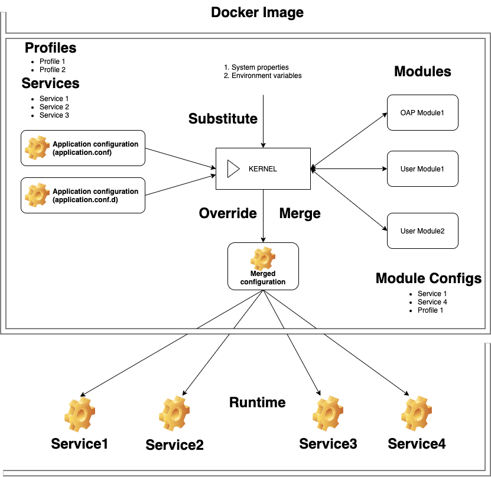

# oap-cookbook

## OAP platform
An application built on top of [OAP platform](https://github.com/oaplatform) may consist from
multiple modules (jar files).  

OAP-based application module types:
* OAP platform module. They could be included into project as a dependency.
* Application module. User modules that implement particular business logic within application.

OAP platform modules:
* [Core module](https://github.com/oaplatform/oap). This is required module, core of the system.
It implements discovering, instantiating and running application services.
* Feature modules. Could be used in application as basic modules that address different aspects of developing 
  high-performance distributed applications.
  * Clients to third party systems like ClickHouse, Aerospike.
  * Storage
  * WebServices

## OAP Modules
Each application module (jar file) can expose it's services, declare dependencies and activate profiles
by defining one or multiple module configuration files in **resource/META-INF** module folder.  

OAP core tries to handle all configuration files with types: 
* json (*.json)
* HOCON (*.conf)
* YAML (*.yaml, *.yml). Preferred.

The naming convention for basic module configuration is **oap-module**. Ex: oap-module.yaml.  

Each module can declare more than one configuration. For example:
* oap-module.conf. Basic configuration.
* oap-ws.yaml. Web Services configuration.

Important: OAP modules also define it's own module configuration files.

## Module configuration
Module configuration contains following items:
1. `name` - String. Name of the module
2. `dependsOn` - List of strings. Name of modules the module depends on
3. `profile/profiles` - String/List of strings. Profile name/names
4. `services` - List of service configurations

### Service configuration contains following items:
Service represents the main base functional unit inside the platform.  
Service configuration describes how to find, run and parametrize the service. 

1. `name` - String. Service name
2. `profile` - String. Profile name that should be turned on to active the service
3. `implementation` - String. Fully qualified service class name. Instance of this class will be created
4. `supervision` - Supervision configuration
5. `remote` - Remote configuration
6. `listen` - Listen configuration
7. `enabled` - Boolean. enable/disable the service
8. `parameters` - Map of key values to parametrize the service

#### Supervision configuration
Supervision configuration describes the details how the service should be created and running.  
The service may define lifecycle methods that will be visible and controlled by supervisor.  

Lifecycle methods should have empty arguments list and empty result type. By default method names are:
* `preStart` - will be called by the supervisor just after instantiation but before method `start`
* `start` - will be called by the supervisor just after instantiation but after method `preStart`
* `preStop` - will be called by the supervisor just before stopping the instance but before method `stop`
* `stop` - will be called by the supervisor just before stopping the instance but after method `preStop`
* `close` - will be called by the supervisor just before destroy the instance but after method `stop` to clean-up resources.

1. `supervise` - Boolean. Should the service be supervised. Supervisor responsibility also is calling service lifecycle methods.
2. `preStartWith`, `startWith`, `preStop`, `stop`, `close` - String. Override lifecycle method names.    
2. `thread` - Boolean. Should the service started in separate thread.
3. `schedule` - Boolean. Should the execution of service be scheduled.
4. `delay` - Long. Milliseconds define delay service execution.
5. `cron` - String. Define cron in format: http://www.quartz-scheduler.org/documentation/quartz-2.x/tutorials/crontrigger.

#### Remote configuration
The service might be configured as remote one. The platform provides an ability to work with remote services transparently
in such way as they are local services by doing network calls in background.

1. `url` - [URI](https://docs.oracle.com/en/java/javase/15/docs/api/java.base/java/net/URI.html). Service URI.
2. `name` - String. Remote service name.
3. `certificateLocation` - [Path](https://docs.oracle.com/en/java/javase/15/docs/api/java.base/java/nio/file/Path.html). Location with SSL certificate.
4. `certificatePassword` - String. Password to access the SSL certificate.
5. `timeout` - Long in milliseconds.
6. `retry` - Integer. The number of retries failure calls to remote service.
7. `serialization` - SerializationMethod. Supported types: BINARY, JSON.

## Application configuration
In order to have a possibility to customize and override module configs in a flexible way   
each application could provide own single standalone application configuration.

Supported types: yaml, hocon.  

Application configuration consists from two blocks:
* List of profiles. To activate particular profiles.
* List of services. Each entry in the list is a pair where they key is service name and value - service parameters.

Specified application configuration will be merged with modules service configurations. 
The specified list of profiles will be considered by the platform as `active` profiles.

